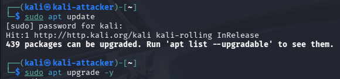

# Kali Linux – Attacker Machine Setup

## Purpose
Dedicated attacker workstation for red team / adversary simulation scenarios.
Runs on bare metal to avoid resource contention with the main workstation.

---

## Hardware
- CPU: Intel i5-2320
- RAM: 8 GB DDR3
- Storage: SATA HDD 500GB
- GPU: NVIDIA GTX 1660 SUPER

---

## Installation
- OS: Kali Linux (Installer)
- Firmware: Legacy BIOS (Award)
- Disk layout: Single partition, full disk
- Bootloader: GRUB installed to /dev/sda

---

### Why Kali Linux on bare metal?
Kali Linux is used as the attacker system and runs on bare metal due to:

- No official Kali Linux images available in GCP
- Running Kali inside UTM on Apple Silicon introduces:
  - ARM compatibility limitations
  - Network isolation issues
  - Host firewall interference
  - Reduced realism for attack tooling

Bare metal deployment ensures:
- Full tool compatibility
- Stable networking
- Realistic attacker behavior

---

## Post-install Verification
The following checks were performed to validate system state:

- System and kernel information
- Disk layout
- Network configuration
- Package updates completed successfully

### System overview

### First system upgrade

---

## System Configuration
- Timezone set correctly
- Core attacker tooling available
- OpenSSH server installed and enabled for:
  - Secure file transfer (SCP / SFTP)
  - Remote management

---

## System Protection
- Timeshift configured for system snapshots
- Snapshot created after base configuration
- Automatic schedule disabled; manual snapshots at major milestones

---

## Status
System is fully operational and ready for attack scenario execution.
