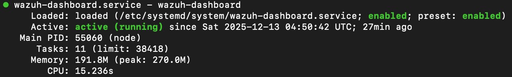
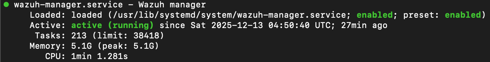
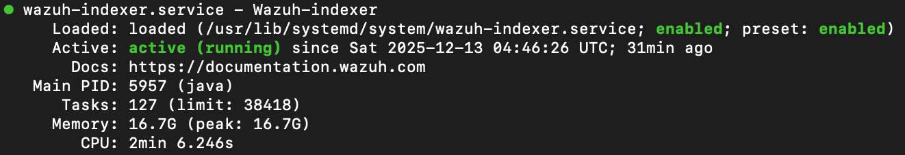

# Wazuh SIEM – Central Monitoring Server

## Purpose
Central Security Information and Event Management (SIEM) platform used to collect,
store, and visualize security telemetry during attack simulation scenarios.

This deployment intentionally uses a weak, default configuration to support
Scenario 1 (weak configuration, no SOC response).

---

## Platform & Hardware
- Cloud provider: Google Cloud Platform (GCP)
- Region / Zone: europe-west4-b
- Machine type: e2-standard-8
  - vCPU: 8
  - Memory: 32 GB
- Storage: 150 GB Balanced Persistent Disk

---

## Installation
- OS: Ubuntu Server 24.04 LTS (minimal)
- Architecture: x86_64
- Wazuh deployment type: Single-node
- Installation method: Official Wazuh install script
- Components installed:
  - Wazuh Manager
  - Wazuh Indexer
  - Wazuh Dashboard
---

### Why Wazuh SIEM?

Wazuh is used as the SIEM platform to provide centralized visibility into
endpoint activity during the attack scenarios.

Wazuh was chosen because it:
- Is an open-source SIEM/XDR platform used in real-world environments
- Supports Windows and Linux endpoint monitoring
- Provides log collection, correlation, and alerting
- Allows full control over detection and configuration

This makes Wazuh suitable for demonstrating how endpoint activity
is detected, analyzed, and responded to in a realistic SOC workflow.

---

## Network Access
- SSH (22/TCP) – management access
- HTTPS (443/TCP) – Wazuh Dashboard
- Wazuh Agent communication:
  - 1514/TCP
  - 1515/TCP

No network hardening or IP restrictions applied (Scenario 1 scope).

---

## Post-install Verification
The following checks were performed to validate the SIEM state:

- All Wazuh services running (manager, indexer, dashboard)
- Dashboard accessible via HTTPS
- Default admin account functional
- No agents connected (initial baseline state)

## Screenshots

### Wazuh Dashboard

### Wazuh Manager

### Wazuh Indexer

---

## Configuration Scope (Scenario 1)
The following configurations were intentionally **not applied**:

- No custom Wazuh rules
- No alert tuning
- No dashboard customization
- No authentication hardening
- No SOC response or automation

This is intentional to demonstrate the impact of weak security configuration.

---

## Security Posture
- Default Wazuh configuration
- Default credentials at initial deployment
- Logging enabled, detection minimal
- SIEM visibility present, response absent

---

## Status
Wazuh SIEM is fully operational and ready to receive telemetry from
Windows Server and Windows 10 endpoints for Scenario 1 execution.
