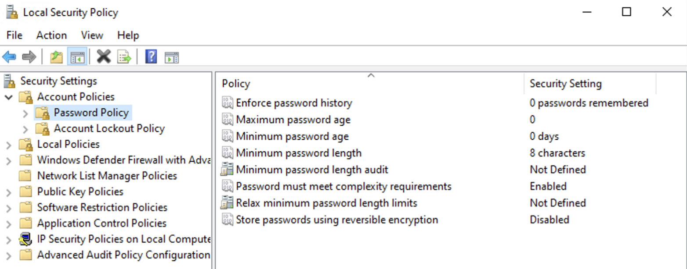
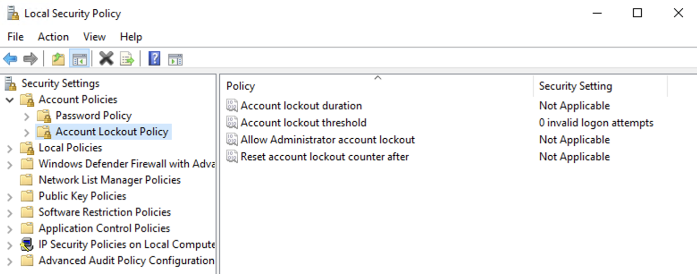

# Windows Server – Target System

## Purpose
Primary attack target system used in Scenario 1.
This machine represents a poorly secured server exposed to the internet,
intentionally configured with weak authentication controls to allow successful
attack execution and observable SIEM telemetry.

---

## Platform & Hardware
- Cloud provider: Google Cloud Platform (GCP)
- Region / Zone: europe-west4-b
- Machine type: e2-standard-4
  - vCPU: 4
  - Memory: 16 GB
- Storage: 80–100 GB Persistent Disk

---

## Installation
- OS: Windows Server 2022
- Deployment type: Cloud VM
- Initial access method: RDP (publicly accessible)

No additional roles or features were installed.
System remains in a default, “vanilla” state.

---

## Network Access
- RDP (3389/TCP) – remote management and attack surface
- Wazuh Agent communication:
  - 1514/TCP
  - 1515/TCP

No network hardening or IP restrictions applied (Scenario 1 scope).

---

## Firewall Configuration (GCP)
The following ingress firewall rules were created to support monitoring:

- TCP 3389 – RDP access
- TCP 1514 – Wazuh agent data channel
- TCP 1515 – Wazuh agent enrollment

Source range: `0.0.0.0/0`  
Target: Windows Server VM  

This intentionally permissive configuration supports Scenario 1
(weak network exposure).

---

## Wazuh Agent Integration
The Windows Server is enrolled as a Wazuh agent to provide basic visibility.

- Agent installed using official Wazuh Windows installer
- Enrollment performed against Wazuh SIEM internal IP
- Default agent configuration used
- No additional log sources enabled

Successful enrollment confirms connectivity and telemetry flow.

---

## Authentication Configuration (Scenario 1)
Authentication controls are intentionally weak and minimally configured.

- Password complexity: Enabled
- Minimum password length: Low (default)
- Account lockout policy: Ineffective / not enforced
- RDP exposed publicly
- Default administrative account in use

This configuration reflects a common real-world weak baseline.

---

## Post-install Verification
The following checks were performed:

- Successful RDP access
- Wazuh agent connected and reporting
- Basic Windows Security Event Logs generated
- No additional hardening applied

---

## Screenshots

### Wazuh Agent Active (Dashboard)

### Password Policy

### Lockout Policy

---

## Configuration Scope (Scenario 1)
The following configurations were intentionally **not applied**:

- No Sysmon
- No advanced audit policies
- No PowerShell logging
- No credential hardening
- No endpoint protection tuning

This allows the attack to succeed while still generating basic security telemetry.

---

## Security Posture
- Weak authentication posture
- Publicly exposed management interface
- Minimal logging
- No active defense mechanisms

This system is intentionally vulnerable to demonstrate
how weak configuration leads to compromise.

---

## Status
Windows Server target system is operational and ready for
Scenario 1 attack execution and SIEM-based analysis.
